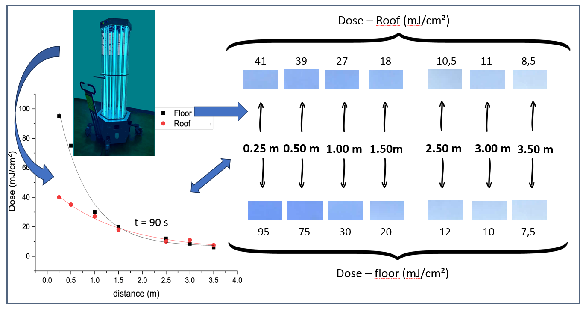

# IEEE-Dosimetry-Strategies-for-Non-Autonomous-UV-C-Robots
# Data and Figures Repository  
**Article:** *Dosimetry Strategies for Non-Autonomous UV-C Robots* – ID 9461  
**Authors:**  
- Maikel Roberto Siqueira Gambeta-Leite ([ORCID: 0009-0007-6842-4706](https://orcid.org/0009-0007-6842-4706))  
- Rodrigo Araujo Real ([ORCID: 0009-0001-8284-4949](https://orcid.org/0009-0001-8284-4949))  
- Chiara das Dores do Nascimento ([ORCID: 0000-0001-6028-9852](https://orcid.org/0000-0001-6028-9852))  
- Everton Granemann Souza ([ORCID: 0000-0001-9884-6626](https://orcid.org/0000-0001-9884-6626))

This repository contains all files required to reproduce the results presented in the article *“Dosimetry Strategies for Non-Autonomous UV-C Robots”*, including editable figures and experimental data.

---
## 📊 Graphical Abstract

  

---
## Repository Contents

### 1. Figures

All figures are located in the `ManuscriptImages/` folder.

- **Figures 3 to 7:** Editable graphs created using **OriginLab** software.
  - Files: `figure3-and-4.opju`, `figure5.opju`, `figure6.opju`, `figure7.opju`
  - Format: `.opju`
  - How to open:
    1. Download the Origin software: [https://www.originlab.com/index.aspx?go=Products/OriginStudentVersion](https://www.originlab.com/index.aspx?go=Products/OriginStudentVersion)
    2. Go to `File > Open > path/filename.opju`
    3. Each file contains:
       - `Book1`: worksheet with raw data
       - `Graph`: corresponding plotted figure

- **Figures 1, 2, 8 and 9 :** High-resolution photographs (to be added in the `ManuscriptImages/` folder).
  - Format: `.png`
  - Use: Visual content included in the manuscript

### 2. Experimental Data

- **Table I:** Correspond to manual counting of **Colony Forming Units (CFUs)** in Petri dishes.
  - File: `tableI-data.txt`
  - Content: Raw colony count data for each experimental condition

## License

This repository is licensed under the [Creative Commons BY-NC 4.0 License](https://creativecommons.org/licenses/by-nc/4.0/).  
You are free to share and adapt the content provided here for **non-commercial purposes**, provided that **appropriate credit** is given.

> **Note:** The `.OPJU` files were generated using a **free academic student license** of OriginLab and are shared **exclusively for educational and academic purposes**, with no affiliation to OriginLab Corporation.

